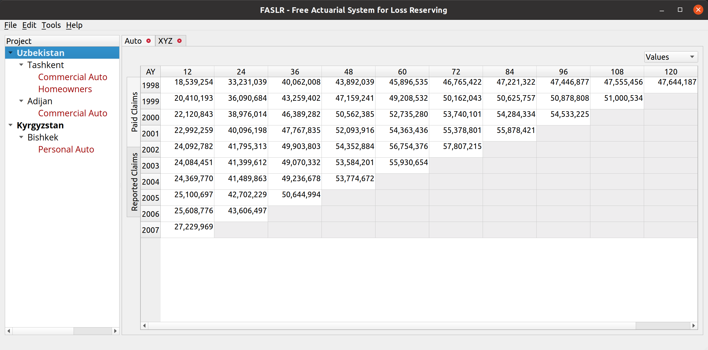
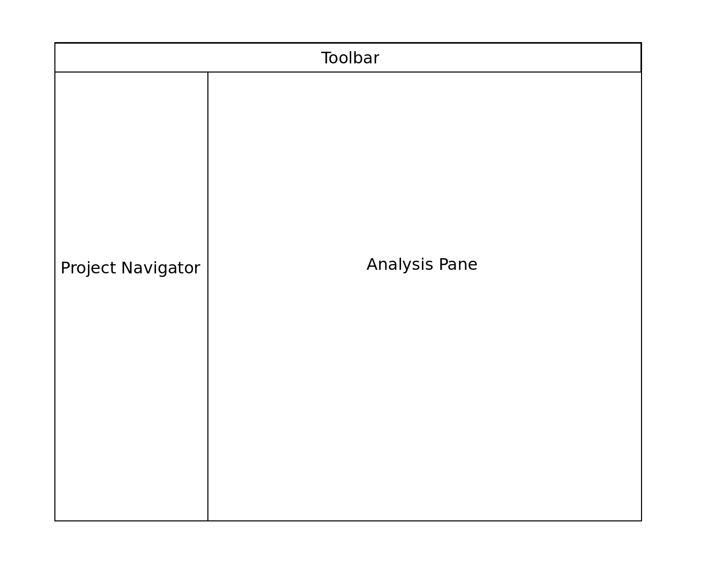
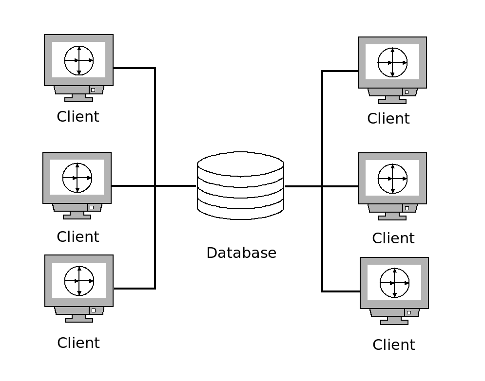

# FASLR
Free Actuarial System for Loss Reserving

FASLR (fæzlɹ̩) is a Qt-based frontend for open-source loss reserving packages. Current plans are to support the [Chainladder](https://github.com/casact/chainladder-python) package.

The actuarial methods and example data used in this project are derived from publicly available papers and data sources. The GUI is developed in Python using the open-source PyQt5 package.

## Project Governance

FASLR will assist in the proper governance of periodic reserve reviews. In addition to being a GUI in which actuarial analyses can be done, it will also serve as a portal through which current and past analyses can be managed. Each reserve analysis will have metadata that indicates its status (in progress, review needed, signed-off), and by storing past analyses, FASLR will make it easy to compare quarter-by-quarter reviews without having to awkwardly navigate company shared folders.

## Basic Interface

FASLR will have a simple layout. The collapsible side pane will contain a navigable tree consisting of past reserve analyses, organized by jurisdiction, LOB, and unit of time.

The analysis pane is where the user will be able to conduct a reserve analysis. This will be the area where the actuary can view triangles, select and perform actuarial methods, and view graphs. The user will also be able to toggle between an analysis view (doing the work) and project metadata (project status, peer review, sign off).

## Department Integration

FASLR will support departments with multiple users, who will have the ability to check out and lock analyses as they are being used. Data will be stored on a database, although the ones that will be supported have yet to be determined. Lightweight deployments for single-users or personal use will use a SQLite data store.

## Contributing

You can evaluate the working version of FASLR by executing the [main.py](https://github.com/casact/FASLR/blob/main/faslr/main.py) program in the [faslr](https://github.com/casact/FASLR/tree/main/faslr) directory.

To learn more about the current structure of the repository, read [ARCHITECTURE.md](https://github.com/casact/FASLR/blob/main/ARCHITECTURE.md).

## Supported Operating Systems

Due to the dominance of Windows in most modern-day actuarial departments, FASLR is intended to be supported on Windows. However, most of the current development is being done on Linux, which is also intended to be supported in order to keep the project fully open source. 